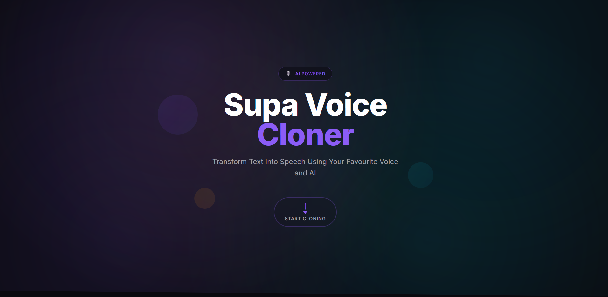
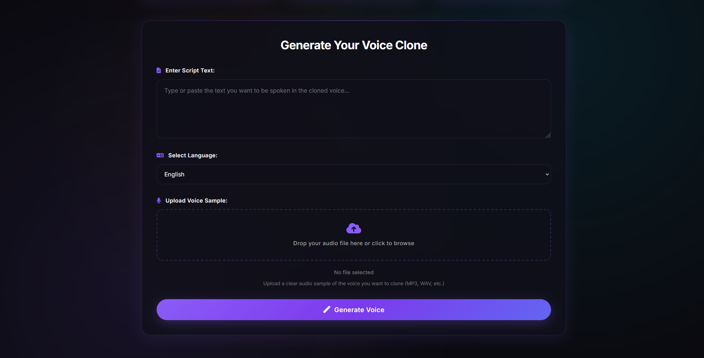

# 🎙️ Supa Voice Cloner

<div align="center">
  
**Transform text into speech with your own voice signature**

[](https://www.python.org/downloads/)
[](https://opensource.org/licenses/MIT)
[](https://github.com/Kabyik-Kayal/SUPA_VOICE_CLONER)
[](https://github.com/Kabyik-Kayal/SUPA_VOICE_CLONER/pulls)
[](https://flask.palletsprojects.com/)

</div>

---

[Live on Huggingface Space](https://huggingface.co/spaces/Kabyik/Supa-voice-cloner)

## ✨ Features

- 🎤 **Voice Cloning**: Clone any voice from a short audio sample
- 🌍 **Multi-language Support**: Generate speech in multiple languages  
- 🔊 **High-Quality Audio**: Crystal clear voice synthesis
- 🖥️ **User-friendly Interface**: Simple web UI for easy interaction
- ⚡ **Fast Processing**: Quick generation of audio files
- 🐳 **Docker Support**: Easy deployment with containerization
- 📡 **REST API**: Programmatic access to voice cloning capabilities
- 🎵 **Multiple Formats**: Support for WAV, MP3, and M4A audio files

## 🖼️ Screenshots

<div align="center">

### Web Application Interface


### Usage Example


</div>

## 📋 Table of Contents

- [🎙️ Supa Voice Cloner](#️-supa-voice-cloner)
  - [✨ Features](#-features)
  - [🖼️ Screenshots](#️-screenshots)
    - [Web Application Interface](#web-application-interface)
    - [Usage Example](#usage-example)
  - [📋 Table of Contents](#-table-of-contents)
  - [🚀 Installation](#-installation)
    - [Prerequisites](#prerequisites)
    - [Quick Setup](#quick-setup)
    - [🐳 Docker Setup](#-docker-setup)
  - [🔧 Usage](#-usage)
    - [Web Interface](#web-interface)
    - [Programmatic Usage](#programmatic-usage)
    - [Supported Languages](#supported-languages)
  - [📡 API Reference](#-api-reference)
    - [Endpoints](#endpoints)
      - [`POST /`](#post-)
      - [`GET /generated/<filename>`](#get-generatedfilename)
  - [� Project Structure](#-project-structure)
  - [👥 Contributing](#-contributing)
    - [Getting Started](#getting-started)
    - [Contribution Guidelines](#contribution-guidelines)
    - [Issues and Feature Requests](#issues-and-feature-requests)
  - [📄 License](#-license)
  - [🙏 Acknowledgements](#-acknowledgements)

## 🚀 Installation

### Prerequisites

- **Python 3.11* - [Download Python](https://www.python.org/downloads/)
- **pip** - Package installer for Python
- **Git** - Version control system

### Quick Setup

1. **Clone the repository:**
```bash
git clone https://github.com/Kabyik-Kayal/SUPA_VOICE_CLONER.git
cd SUPA_VOICE_CLONER
```

2. **Create and activate a virtual environment:**
```bash
# Create virtual environment
python -m venv venv

# Activate virtual environment
# On Windows
venv\Scripts\activate
# On macOS/Linux
source venv/bin/activate
```

3. **Install dependencies:**
```bash
pip install -r requirements.txt
```

4. **Run the application:**
```bash
python app.py
```

5. **Access the application:**
   Open your browser and navigate to `http://localhost:5000`

### 🐳 Docker Setup

For running the app locally with Docker:
```docker

#For Nvidia GPU supported version
docker run -p 5000:5000 supa-voice-cloner kabyik/supa-voice-cloner:latest 

#For CPU only version
docker run -p 5000:5000 supa-voice-cloner kabyik/supa-voice-cloner:cpu

```

1. **Access the application:**
   Navigate to `http://localhost:5000` in your browser

## 🔧 Usage

### Web Interface

1. **Start the Flask server:**
```bash
python app.py
```

2. **Open your browser** and navigate to `http://localhost:5000`

3. **Use the interface:**
   - Type or paste your script into the text area
   - Select the language for the output
   - Upload a voice sample (WAV, MP3, or M4A format)
   - Click "Generate Voice" and wait for processing
   - Download or play the generated audio file

### Programmatic Usage

```python
from pipelines.voice_cloner import voice_cloning_pipeline

# Clone a voice with custom parameters
generated_voice_path = voice_cloning_pipeline(
    script="Hello world, this is my cloned voice speaking!",
    uploaded_voice_path="/path/to/your/voice_sample.wav",
    language="en"
)

print(f"Generated audio saved to: {generated_voice_path}")
```

### Supported Languages

The application supports multiple languages including:
- English (`en`)
- Hindi (`hi`)
- Spanish (`es`) 
- French (`fr`)
- German (`de`)
- And many more...

## 📡 API Reference

### Endpoints

#### `POST /`
Clone a voice with the provided script and voice file.

**Request Parameters:**
| Parameter | Type | Required | Description |
|-----------|------|----------|-------------|
| `script` | string | Yes | The text to convert to speech |
| `language` | string | No | Language code (default: "en") |
| `voice_file` | file | Yes | Audio file containing the voice to clone |

**Supported Audio Formats:**
- WAV (`.wav`)
- MP3 (`.mp3`) 
- M4A (`.m4a`)

**Example Response:**
```json
{
  "message": "Voice cloning successful",
  "generated_voice_path": "/generated/cloned_voice_20250722_143022.wav"
}
```

**Error Response:**
```json
{
  "error": "Script and voice file are required"
}
```

#### `GET /generated/<filename>`
Retrieve a generated audio file.

**Parameters:**
- `filename` (string): Name of the generated audio file

**Response:** Audio file download

## � Project Structure

```
SUPA_VOICE_CLONER/
├── 📁 app.py                 # Main Flask application
├── 📁 requirements.txt       # Python dependencies
├── 📁 docker-requirements.txt # Docker-specific dependencies  
├── 📁 Dockerfile            # Docker configuration
├── 📁 setup.py              # Package setup configuration
├── 📁 LICENSE               # MIT License file
├── 📁 readme.md             # Project documentation
│
├── 📂 artifacts/            # Generated artifacts
│   ├── 📂 audio/           # Processed audio files
│   └── 📂 model/           # Model artifacts
│
├── 📂 assets/               # Project assets
│   ├── 🖼️ usage_example.png  # Usage demonstration
│   └── 🖼️ web_app.png       # Web interface screenshot
│
├── 📂 config/               # Configuration files
│   ├── __init__.py
│   └── paths_config.py      # Path configurations
│
├── 📂 pipelines/            # Core processing pipelines
│   └── voice_cloner.py      # Main voice cloning logic
│
├── 📂 src/                  # Source code modules
├── 📂 static/               # Static web assets
├── 📂 templates/            # HTML templates
├── 📂 utils/                # Utility functions
└── 📂 logs/                 # Application logs
```

## 👥 Contributing

We welcome contributions! Here's how you can help improve Supa Voice Cloner:

### Getting Started

1. **Fork the repository** on GitHub
2. **Clone your fork** locally:
   ```bash
   git clone https://github.com/your-username/SUPA_VOICE_CLONER.git
   ```
3. **Create a feature branch:**
   ```bash
   git checkout -b feature/amazing-feature
   ```
4. **Make your changes** and commit them:
   ```bash
   git commit -m 'Add some amazing feature'
   ```
5. **Push to your branch:**
   ```bash
   git push origin feature/amazing-feature
   ```
6. **Open a Pull Request** on GitHub

### Contribution Guidelines

- 📝 Follow the existing code style
- ✅ Add tests for new features
- 📚 Update documentation as needed
- 🔍 Ensure all tests pass before submitting
- 💬 Provide clear commit messages

### Issues and Feature Requests

- 🐛 **Bug Reports**: Use the issue tracker to report bugs
- 💡 **Feature Requests**: Suggest new features via issues
- 🤝 **Help Wanted**: Check issues labeled "help wanted"

## 📄 License

This project is licensed under the **MIT License** - see the [LICENSE](LICENSE) file for details


## 🙏 Acknowledgements

Special thanks to the following projects and contributors:

- 🎤 **[Coqui TTS](https://github.com/coqui-ai/TTS)** - Providing the foundation for TTS capabilities
- 🤖 **[Hugging Face](https://huggingface.co/)** - For transformer models and tools
- 🌐 **[Flask](https://flask.palletsprojects.com/)** - Web framework powering the interface
- 🎵 **[LibROSA](https://librosa.org/)** - Audio analysis and processing
- 🐍 **[PyTorch](https://pytorch.org/)** - Deep learning framework
- 👥 **Open Source Community** - All contributors who made this project possible

---

<div align="center">

**Made with ❤️ by [Kabyik-Kayal](https://github.com/Kabyik-Kayal)**

⭐ **Star this repo if you find it useful!** ⭐

[🔗 GitHub Repository](https://github.com/Kabyik-Kayal/SUPA_VOICE_CLONER) • [📝 Documentation](https://github.com/Kabyik-Kayal/SUPA_VOICE_CLONER/wiki) • [🐛 Report Bug](https://github.com/Kabyik-Kayal/SUPA_VOICE_CLONER/issues) • [💡 Request Feature](https://github.com/Kabyik-Kayal/SUPA_VOICE_CLONER/issues)

</div>
